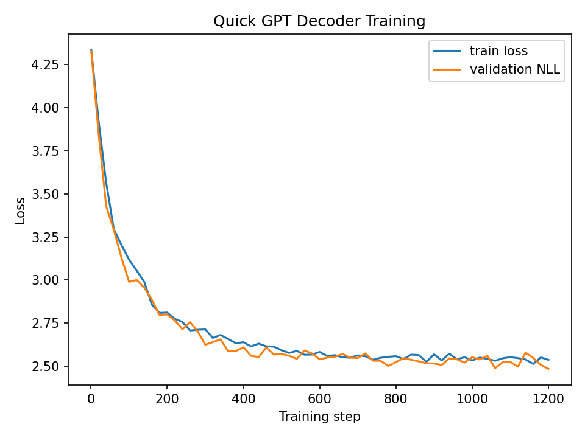
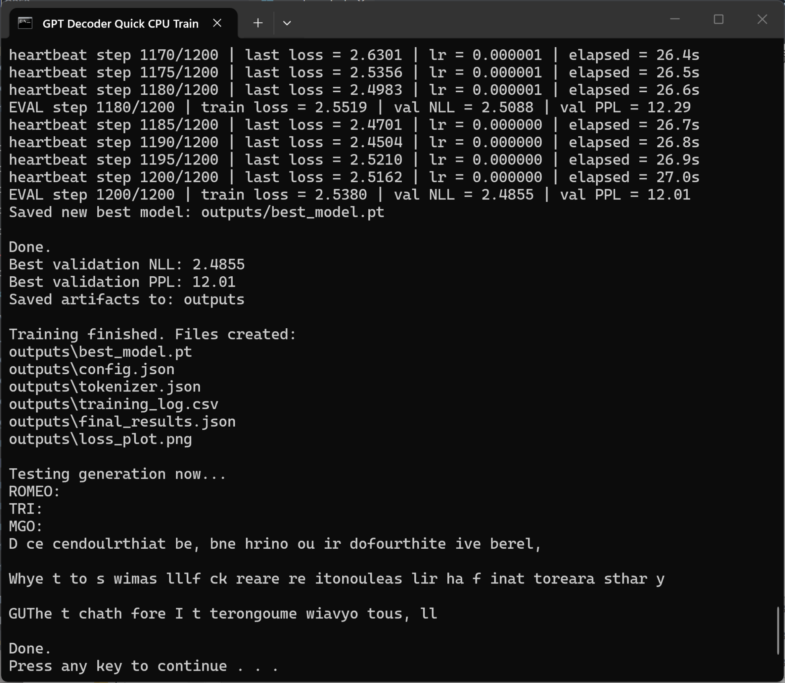

# GPT Decoder-Only Transformer From Scratch

This project implements a small **decoder-only Transformer** for character-level next-token prediction on the **Tiny Shakespeare** dataset. The goal is to demonstrate the core GPT-style training pipeline: dataset preparation, causal self-attention, masked language modeling, checkpoint saving, and text generation.

Repository: https://github.com/jentimanatol/NLP_GPT_decoder_only

---

## Project Summary

The model is a simplified GPT-style decoder-only Transformer. It uses causal self-attention so each token can attend only to previous tokens, not future tokens. The training objective is next-character prediction.

Main idea:

```text
Input characters  -> token IDs -> Transformer decoder -> logits -> next-token loss
```

The project includes:

- `data.py` — dataset loading and character-level tokenization
- `model.py` — decoder-only Transformer model
- `train.py` — full training script
- `train_fast.py` — faster training script
- `train_quick_cpu.py` — quick CPU reproducibility training script
- `generate.py` — text generation from a trained checkpoint
- `.bat` files — simple Windows commands for running the project
- `outputs/` — saved model, config, tokenizer, logs, and plots
- `tex/` — LaTeX report files

---

## Dataset

The project uses the **Tiny Shakespeare** dataset. It is small enough for CPU testing and is useful for demonstrating character-level language modeling.

To download the dataset, run:

```bat
download_dataset.bat
```

or:

```bat
python data.py
```

depending on the local project version.

---

## Model Description

The model is a decoder-only Transformer similar to the basic structure used in GPT models.

Important components:

1. **Token embedding** — converts character IDs into vectors.
2. **Positional embedding** — adds token position information.
3. **Causal self-attention** — prevents the model from seeing future tokens.
4. **Feed-forward layers** — process hidden representations.
5. **Layer normalization and residual connections** — stabilize training.
6. **Linear output head** — predicts the next character.

The model is intentionally small so it can run on a normal CPU.

---

## Training

For quick CPU testing, run:

```bat
training.bat
```

This runs a fixed-step training test instead of waiting for full epochs. It is useful for homework submission because it proves the training loop works quickly and reproducibly.

Example successful run:

```text
Best validation NLL: 2.4855
Best validation PPL: 12.01
Saved artifacts to: outputs
```

The model improved during training, which confirms that the decoder-only Transformer learned from the dataset.

---

## Training Result

The plot below shows training loss and validation negative log-likelihood decreasing during the 1200-step CPU training run.




The validation perplexity reached approximately **12.01**, which is acceptable for a small character-level CPU-trained demo model.

---

## Terminal Evidence

The terminal output confirms that the training completed successfully and saved the expected output files.



Created output files:

```text
outputs/best_model.pt
outputs/config.json
outputs/tokenizer.json
outputs/training_log.csv
outputs/final_results.json
outputs/loss_plot.png
```

---

## Text Generation

After training, the generation script loads the saved model checkpoint and produces text beginning from a prompt such as:

```text
ROMEO:
```

Because this is a very small character-level model trained for a short CPU run, the generated text is not perfect English. However, it shows that the full pipeline works:

```text
training -> checkpoint -> loading model -> text generation
```

---

## How to Run

### 1. Create and activate a virtual environment

```bat
python -m venv venv
venv\Scripts\activate
```

### 2. Install requirements

```bat
pip install -r requirements.txt
```

### 3. Download dataset

```bat
download_dataset.bat
```

### 4. Run quick CPU training

```bat
training.bat
```

### 5. Generate text

```bat
run_generation.bat
```

or:

```bat
python generate.py
```

---

## Notes for Instructor / Reviewer

This project focuses on **Part I: NLP GPT decoder-only model**. It demonstrates causal self-attention and the next-token prediction objective. The quick CPU training file is included to make the project easy to test without requiring GPU hardware or long training time.

The purpose of the quick training script is not to produce a production-quality language model. Its purpose is to prove that:

- the model architecture works,
- loss decreases during training,
- validation perplexity improves,
- the best checkpoint is saved,
- and generated text can be produced from the trained model.

---

## Final Result

The final 1200-step CPU test reached:

```text
Best validation NLL: 2.4855
Best validation PPL: 12.01
```

This confirms that the GPT-style decoder-only Transformer training pipeline is working correctly.
